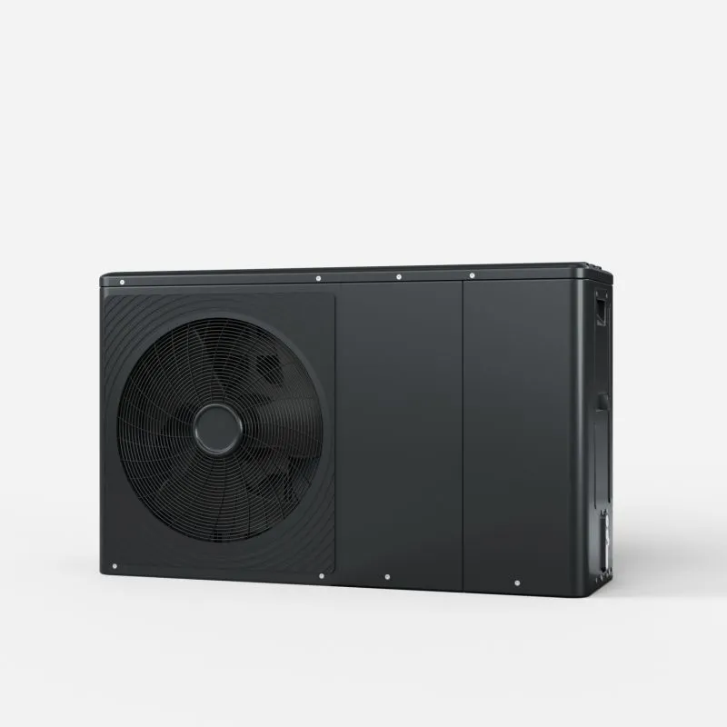

# Brötje Heizsystem Integration für Home Assistant

🇬🇧 [English Version](README.md)

Home Assistant Integration für Brötje Heizsysteme über Modbus TCP, mit Unterstützung für das **IWR/GTW-08** Gateway (Wärmepumpen) und das **ISR Plus** Modul (Gasheizungen und ältere Systeme).

## Unterstützte Module

Diese Integration unterstützt zwei Brötje Modbus-Module. Bei der Installation wählt man aus, welches Modul das eigene System verwendet. Beide können parallel installiert werden, wenn mehrere Heizgeräte vorhanden sind.

| Modul | Typ | Typischer Einsatz | Status |
|-------|-----|-------------------|--------|
| **IWR / GTW-08** | Gateway-Modul | Wärmepumpen, neuere Systeme | Unterstützt |
| **ISR Plus** | Modbus-Modul | Gasheizungen, ältere Systeme | Unterstützt |

### IWR / GTW-08 (Gateway-Modul)

Das IWR/GTW-08 ist das aktuelle Modbus-Gateway für Brötje Wärmepumpen und neuere Heizsysteme. Es bietet umfassende Überwachung:

- Gerätetemperaturen, Drücke und Leistung
- Wärmepumpen-Status (Hauptstatus + Substatus mit 100+ Codes)
- Energiezähler (Verbrauch und Lieferung, je HZG/TWW/Kühlung)
- COP-Überwachung
- Bis zu 12 konfigurierbare Zonen mit Temperaturen, Sollwerten und Pumpenstatus pro Zone
- Bitfeld-basierte Statusindikatoren (Flamme, Wärmepumpe, Zusatzerzeuger, Ventile)
- Wartungs- und Fehlerdiagnose pro Leiterplatte

Registerspezifikationen:
- GTW-08 Modbus (7854678 - v.01) — Englisch
- Modbus GTW-08 Parameterliste (7740782-01) — Deutsch

### ISR Plus (Legacy-Modul)

Das ISR Plus Modul ist die ältere Modbus-Schnittstelle, die in Brötje Gasheizungen und einigen Wärmepumpen-Installationen zu finden ist. Es bietet:

- Heizkreis 1 Temperaturen und Sollwerte
- Trinkwasser-Einstellungen (TWW) und Speicherstatus
- Pufferspeicher-Überwachung
- Kessel-/Brennerstatus und Energiezähler
- Allgemeine Funktionen (Außentemperatur, Alarmrelais)

Registerspezifikation: [de-de_ma_modbm.pdf](https://polo.broetje.de/pdf/7715040=6=pdf_(bdr_a4_manual)=de-de_ma_modbm.pdf)

## Unterstützte Modelle

**Brötje BLW Eco 10.1** (getestet mit ISR und IWR)

*Andere Brötje Heizsysteme mit Modbus-Schnittstelle sollten ebenfalls funktionieren.*

## Funktionen

- **Zwei Modultypen**: IWR/GTW-08 und ISR Plus, bei der Einrichtung auswählbar
- **Parallelbetrieb**: Beide Module können gleichzeitig für verschiedene Geräte laufen
- **Nur-Lesen Überwachung**
- **IWR**: ~213 Entitäten (1 Zone) bis ~884 Entitäten (12 Zonen) — Hauptgerät, Zonenparameter & -messwerte, Geräteinformationen, Wartung, Fehlerdiagnose
- **ISR**: 117 Entitäten (100 Sensoren + 17 Binärsensoren) in 6 Kategorien
- **Zonenerkennung** (IWR): Erkennt aktive Zonen automatisch durch Auslesen der Zonentyp- und Zonenfunktionsregister vom Gerät; aktive Zonen werden vorausgewählt, inaktive angezeigt aber nicht ausgewählt. Manuelle Auswahl ebenfalls möglich.
- **Konfigurierbare Zonen** (IWR): 1–12 Zonen bei der Einrichtung auswählbar oder über Integrationsoptionen neu konfigurierbar
- **Konfigurierbares Abfrageintervall**: Über Integrationsoptionen einstellbar (Standard: 120 Sekunden)
- **Deutsche und englische Übersetzungen**
- **Sentinel-Wert-Filterung**: Ungültige Modbus-Werte (0xFFFF, 0xFFFFFFFF) werden als „Nicht verfügbar" angezeigt statt als unsinnige Zahlen

### ISR Kategorien

| Kategorie | Sensoren | Binärsensoren | Beschreibung |
|-----------|----------|---------------|--------------|
| **Heizkreis 1** | 21 | 5 | Temperaturen, Sollwerte, Pumpe, Mischer |
| **Trinkwasser (TWW)** | 12 | - | Betriebsart, Legionellen, Zirkulation |
| **Trinkwasserspeicher** | 11 | 3 | Speichertemperaturen, Pumpen |
| **Pufferspeicher** | 5 | 2 | Puffertemperaturen, Ventile |
| **Kessel** | 31 | 3 | Brenner, Gebläse, Energiezähler |
| **Allgemeine Funktionen** | 3 | 4 | Außentemperatur, Alarm, Handbetrieb |

> **Hinweis:** Aktuell wird für ISR nur **Heizkreis 1 (HK1)** unterstützt. Unterstützung für HK2/HK3 kann in zukünftigen Versionen hinzugefügt werden.

### IWR Kategorien

| Kategorie | Register | Beschreibung |
|-----------|----------|--------------|
| **Gerät - Messwerte** | 26 | Temperaturen, Drücke, Status, Leistung |
| **Gerät - Temperaturen** | 6 | Vorlauf, Rücklauf, interne Sollwerte |
| **Gerät - Steuerung** | 4 | Sommer/Winter-Schwelle, Frostschutz, Zwangsmodi |
| **Gerät - Effizienz** | 2 | COP-Überwachung |
| **Gerät** | 9 | HZG/TWW/Kühlung ein/aus |
| **Regler-Überwachung** | 30 | Statusbits, Ausgangsstatus, Wärmeanforderung, Energiezähler |
| **Zonen - Parameter** (pro Zone) | 44 | Sollwerte, Heizkurven, Regelstrategie, Zeitprogramme |
| **Zonen - Messwerte** (pro Zone) | 17 | Außen-/Raum-/Vorlauftemperaturen, Wärmebedarf, Ventil, Pumpe |
| **Geräteinformation** | 1 | Gateway-Gerätetyp |
| **Systemerkennung** | 59 | Angeschlossene Platinen, Gerätetypen, Softwareversionen, Artikelnummern |
| **Wartung** | 14 | Wartungsmeldungen, Stunden/Starts seit Wartung, Fehler pro Platine |
| **Kaskade** | 2 | Kaskadenstatus |

> Die Anzahl der Entitäten skaliert mit der Anzahl konfigurierter Zonen: ~213 Entitäten für 1 Zone, bis zu ~884 für 12 Zonen.

## Voraussetzungen

- Brötje Heizsystem mit Modbus-Schnittstelle
- Modbus TCP Gateway verbunden mit dem Heizsystem
- Home Assistant 2024.1.0 oder neuer

## Installation

### HACS (Empfohlen)

1. HACS in Home Assistant öffnen
2. Auf "Integrationen" klicken
3. Die drei Punkte oben rechts anklicken
4. "Benutzerdefinierte Repositories" auswählen
5. `https://github.com/henrywiechert/ha-broetje` hinzufügen und "Integration" als Kategorie wählen
6. "Hinzufügen" klicken
7. Nach "Brötje" suchen und installieren
8. Home Assistant neu starten

### Manuelle Installation

1. Den Ordner `custom_components/broetje_heating` herunterladen
2. In das Home Assistant Verzeichnis `config/custom_components/` kopieren
3. Home Assistant neu starten

## Konfiguration

1. Zu **Einstellungen** → **Geräte & Dienste** gehen
2. **Integration hinzufügen** klicken
3. Nach "Brötje" suchen
4. **Modultyp auswählen**: ISR oder IWR
5. Verbindungsdaten eingeben:
   - **Host**: IP-Adresse des Modbus TCP Gateways
   - **Port**: Modbus TCP Port (Standard: 502)
   - **Unit ID**: Modbus Slave ID (Standard: 1)
6. **Nur IWR**: Zoneneinrichtungsmethode wählen:
   - **Automatisch erkennen**: Liest Zonentyp- und Zonenfunktionsregister vom Gerät; aktive Zonen werden vorausgewählt, inaktive angezeigt aber nicht ausgewählt. Auswahl prüfen und bestätigen.
   - **Manuell**: Beliebige Kombination der Zonen 1–12 auswählen.

Um ein zweites Modul hinzuzufügen (z.B. ISR und IWR), die Integration einfach erneut hinzufügen und den anderen Modultyp auswählen.

### Optionen

Nach der Einrichtung kann über das **Konfigurieren**-Symbol (Zahnrad) am Integrationseintrag Folgendes angepasst werden:

- **Abfrageintervall**: Wie oft die Integration das Modbus-Gerät abfragt (Standard: 120 Sekunden, Bereich: 10–3600). Änderungen werden sofort ohne Neustart wirksam.
- **Zonenkonfiguration** (nur IWR): Automatische Erkennung erneut ausführen oder aktive Zonen manuell ändern. Änderungen lösen einen Neustart der Integration aus.

## Entitäten

Siehe [ENTITIES.md](ENTITIES.md) für eine vollständige Liste der ISR Entitäten mit Modbus-Registeradressen und Beschreibungen.

Für IWR-Entitäten siehe [`register_map.csv`](register_map.csv) für eine umfassende Registertabelle mit Adressen, Datentypen, Beschreibungen (DE/EN), Einheiten, Skalierungsfaktoren und Kategorien.

### Highlights

- **Temperaturen**: Vorlauf, Rücklauf, Raum, Außen, Abgas, Wärmepumpe
- **Energiezähler**: Verbrauchte und gelieferte Energie für HZG, TWW und Kühlung (kWh)
- **Betriebsstunden**: Gesamtstunden, Zusatzerzeuger-Stunden, Pumpenstunden pro Zone
- **Statusinformationen**: Haupt-/Substatus, Pumpenzustände, Ventilstellungen, Flamme/WP ein
- **COP**: Leistungszahl-Überwachung (IWR)
- **Diagnose**: Fehlercodes und Schweregrad pro Leiterplatte, Wartungsmeldungen

Nicht jeder Sensor ist in allen Heizsystemen verfügbar! Z.B. Gasverbrauch bei Wärmepumpen oder COP bei Gasheizungen.

## Fehlerbehebung

### Verbindung zum Gerät nicht möglich

- Prüfen ob das Modbus TCP Gateway von Home Assistant erreichbar ist
- IP-Adresse und Port überprüfen
- Sicherstellen dass die Modbus Unit ID mit der Gerätekonfiguration übereinstimmt
- Konnektivität mit einem Modbus-Tool wie `mbpoll` testen

### Keine Sensorwerte

- Die Registeradressen müssen möglicherweise für das spezifische Modell angepasst werden
- Home Assistant Logs auf Modbus-Kommunikationsfehler prüfen
- Manche Sensoren zeigen „Nicht verfügbar" wenn das Gerät Sentinel-Werte meldet (0xFFFF) — das ist normal für nicht genutzte Funktionen

## Entwicklung

Diese Integration verwendet:

- [pymodbus](https://pymodbus.readthedocs.io/) ≥3.11.0 für Modbus TCP Kommunikation
- Home Assistant's `DataUpdateCoordinator` für effizientes Polling

### Mitwirken

Beiträge sind willkommen! Bitte:

1. Repository forken
2. Feature-Branch erstellen
3. Pull Request einreichen

## Roadmap

- [ ] Schreibunterstützung für R/W Register
- [ ] Zusätzliche Heizkreise für ISR (HK2, HK3)
- [X] Brötje Logo im offiziellen HA brand repo

## Danksagungen

- [@der-seemann](https://github.com/der-seemann) — Viele ideen und Feature-Vorschläge

## Lizenz

Dieses Projekt ist unter der MIT-Lizenz lizenziert - siehe [LICENSE](LICENSE) für Details.

## Haftungsausschluss

Diese Integration ist nicht mit der Firma Brötje in irgendeiner Form verbunden oder von Brötje unterstützt. Verwendung auf eigene Gefahr.
